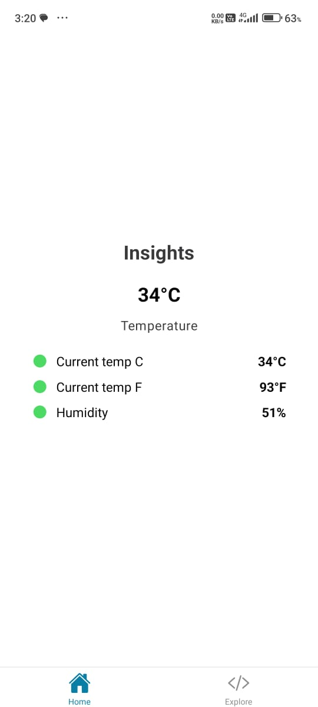
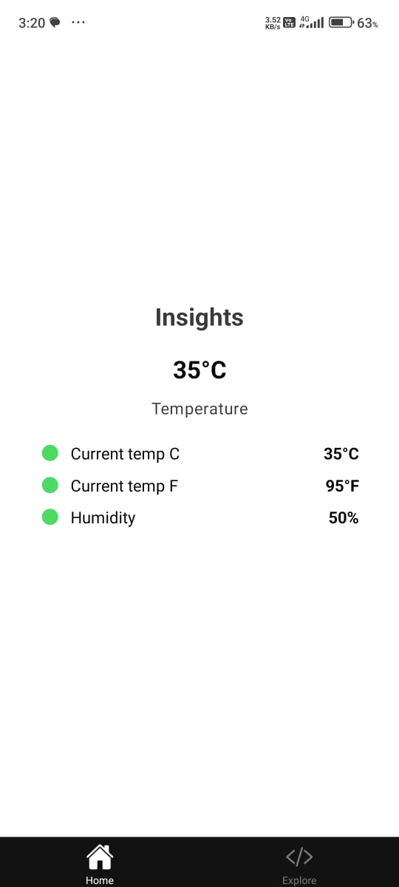

# weather-rpi

A weather station for the Raspberry Pi.

## Preview
**Screens**



## Installation
1. Make sure you have a raspberry pi with Raspberry Pi OS installed. Instructions can be found [here](https://www.raspberrypi.com/documentation/computers/getting-started.html)
2. Clone the repository
    ```bash
    git clone https://github.com/AumPauskar/weather-rpi.git
    ```
3. Install the dependencies
    ```bash
    cd weather-api/
    python3 -m venv env
    source env/bin/activate
    pip3 install -r requirements.txt
    ```
4. Run the application
    ```bash
    python3 main.py
    ```
5. Download the client app (in development)
6. If release is unavailable or app needs to be customized, follow the instructions [here](docs/client-installaion.md)