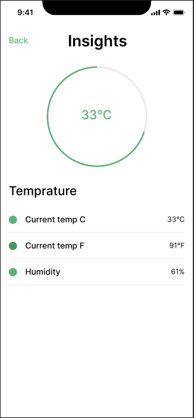
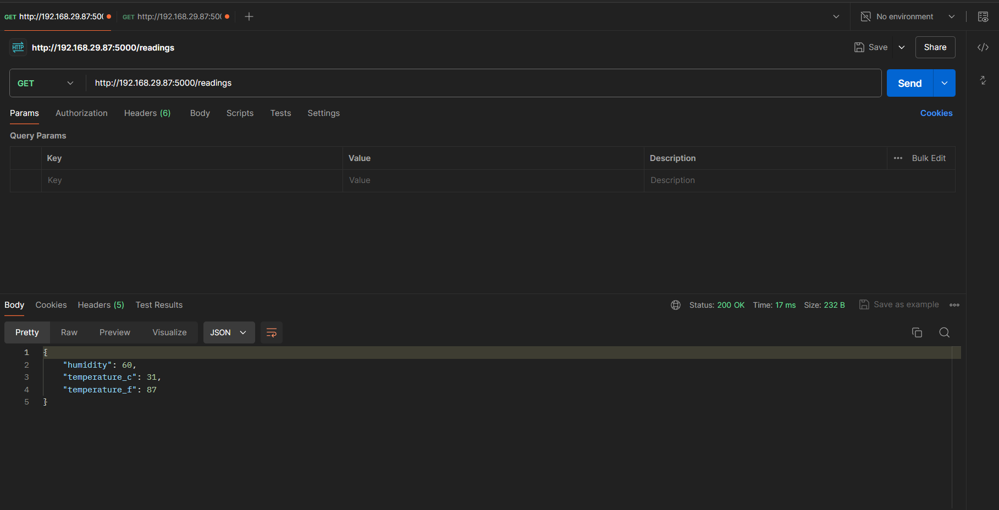
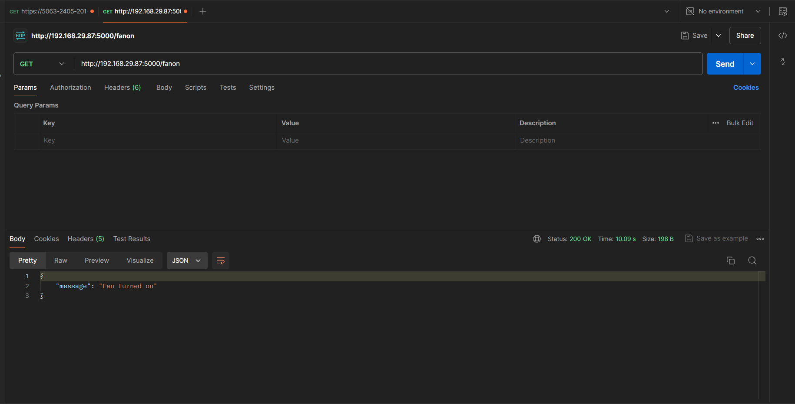
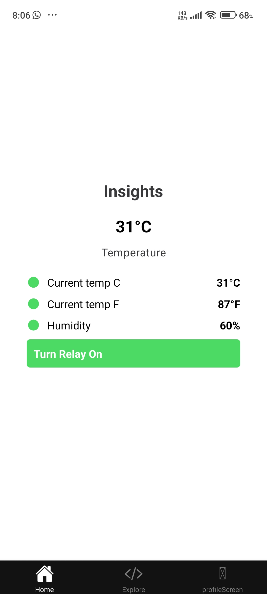

# Automatic watering system for garden

## Introduction

In today's fast-paced world, maintaining a flourishing garden can be a challenge. Busy schedules and unpredictable weather patterns often lead to underwatering or overwatering of plants, resulting in wilting, stunted growth, or even plant death. This is where an **automatic watering system** powered by the **Internet of Things (IoT)** comes in.

This project aims to develop an intelligent watering system that utilizes sensors and internet connectivity to deliver the right amount of water to the garden, **automatically**. This system will take the guesswork out of watering, ensuring the plants receive the optimal moisture level they need to thrive, regardless of the availability.

Here are some of the key benefits you can expect from this automatic watering system:

1. **Reduced water waste:** By watering only when necessary, the system helps conserve this precious resource.
2. **Improved plant health:** Consistent and controlled watering promotes healthy growth and prevents underwatering or overwatering stress.
3. **Convenience:** The system automates the watering process, freeing up the time and ensuring the plants are cared for even when you're away.
4. **Data-driven insights:** With the integration of IoT, the system can potentially collect data on soil moisture and adjust watering schedules based on real-time conditions.

This project will delve into the design, components, and functionalities of this automatic watering system, providing a roadmap for creating a smart and sustainable solution for the garden.

## Components and Interfacing

The core of the automatic watering system will consist of several key components working together to monitor and control the watering process. Here's a breakdown:

* **DHT-11 Sensor:** This sensor plays a crucial role by measuring the temperature and humidity levels surrounding the plants. This data can be valuable  for adjusting watering schedules based on environmental conditions. The DHT-11 is a digital sensor that communicates with the Raspberry Pi using a single data pin. You'll need to install appropriate libraries on the Raspberry Pi to interact with the sensor and read its readings.

* **Relay:** This component acts as a switch controlled by the Raspberry Pi. When the Raspberry Pi determines watering is needed, it sends a signal to the relay, which then activates the connected water pump, turning on the water flow. Relays typically require a driver circuit to handle the current needed to activate the coil within the relay. You'll need to choose a driver circuit compatible with the chosen relay and Raspberry Pi's capabilities.

* **Raspberry Pi:** This single-board computer serves as the brain of the system. It will be responsible for:
    * **Reading sensor data:** The Raspberry Pi will collect data from the DHT-11 sensor, including temperature and humidity readings. 
    * **Processing data:** Based on the sensor readings and pre-programmed watering rules, the Raspberry Pi will determine if watering is necessary.
    * **Controlling the relay:** The Raspberry Pi will send a control signal to the relay when watering is required, activating the water pump.
    * **Optional: Connectivity:** Client can potentially connect the Raspberry Pi to the internet to enable remote monitoring and control of the system. This can be achieved through Wi-Fi or ethernet connectivity.

**Interfacing the Components:**

Interfacing these components with the Raspberry Pi will involve some electrical connections and software configuration. Here's a general overview:

1. **Wiring:** 
    * Connect the DHT-11 sensor's power and data pins to the designated GPIO pins on the Raspberry Pi according to the sensor's datasheet and chosen library.
    * Connect the relay's control coil to the appropriate GPIO pin on the Raspberry Pi through the driver circuit. Ensure the driver circuit can handle the current requirements of the relay. 
    * Connect the water pump to the relay's output contacts and power source with appropriate safety measures.

2. **Software Configuration:**
    * Install the necessary libraries on the Raspberry Pi to interact with the DHT-11 sensor.
    * Write Python code to:
        * Read data from the DHT-11 sensor.
        * Define logic for determining when watering is needed (based on sensor readings and pre-set rules).
        * Control the relay based on the watering decision.

**Additional Considerations:**

* **Power Supply:** A separate power supply for the Raspberry Pi and potentially another for the water pump depending on its power requirements.
* **Enclosure:** Consider housing all the components in a weatherproof enclosure to protect them from the elements.

By effectively interfacing these components and writing the appropriate code, you'll create the core functionality of the automatic watering system. 

## UI/UX
## User Interface (UI) with React, Expo, and Fetch API

Since the project utilizes a Raspberry Pi for local control, a mobile application for remote monitoring and control can be a valuable addition. Here's how you can build a user interface (UI) using React with Expo and the Fetch API to interact with the watering system module:

**1. Setting Up the Project:**

* Start by creating a new React Native project using Expo CLI: `expo init theProjectName`
* Install any necessary dependencies like `axios` (a popular promise-based HTTP client) for making API requests: `expo install axios`

**2. Building the UI Components:**

* Design the UI using React components. You can leverage Expo's built-in UI components or explore third-party libraries like React Native Elements or NativeBase for a wider range of pre-built components.
* Consider incorporating elements like:
    * **Sensor Data Display:** Show real-time temperature and humidity readings received from the Raspberry Pi module.
    * **Watering Controls:** Include buttons or toggles to manually trigger watering or adjust watering schedules remotely.
    * **Watering Status:** Display the current status of the watering system (idle, watering, etc.).

**3. Fetching Data and Controlling the Module:**

* Implement the Fetch API or a library like Axios to make API requests to an endpoint exposed by the Raspberry Pi module. 
* This endpoint could potentially return sensor data and accept commands to control the watering system (e.g., start/stop watering).

**Here's a basic example using the Fetch API to fetch sensor data:**

```javascript
const fetchData = async () => {
  try {
    const response = await fetch('http://the_raspberry_pi_ip:the_port/api/data');
    const data = await response.json();
    // Update UI components with received sensor data (temperature, humidity)
  } catch (error) {
    console.error(error);
    // Handle errors appropriately (e.g., display error message to user)
  }
};

// Call fetchData on component mount or at regular intervals
useEffect(() => {
  fetchData();
}, []);
```

**4. Sending Control Commands:**

Similarly, you can use the Fetch API or Axios to send commands to control the watering system. The specific endpoint and data format for these commands will depend on how you implement the API on the Raspberry Pi module.

```javascript
const startWatering = async () => {
  try {
    await fetch('http://the_raspberry_pi_ip:the_port/api/control', {
      method: 'POST',
      headers: { 'Content-Type': 'application/json' },
      body: JSON.stringify({ command: 'start_watering' }),
    });
    // Update UI to reflect watering started
  } catch (error) {
    console.error(error);
    // Handle errors appropriately
  }
};
```

**5. Security Considerations:**

* When implementing the API on the Raspberry Pi, ensure proper authentication and authorization mechanisms are in place to prevent unauthorized access or control of the watering system.

By following these steps, a user-friendly mobile application that provides remote monitoring and control capabilities for the automatic watering system. Remember to adapt the code snippets to the specific API implementation on the Raspberry Pi module.

## Code

### Prototyping
The UI/UX design can be prototyped using tools like Figma, here are the couple of designs we can create for the automatic watering system:



API testing can be done using tools like Postman, here is a sample request to fetch sensor data from the Raspberry Pi module:


### Sample code
The code is divided into two parts:
- Raspberry Pi API for handling sensor data and controlling the watering system.
- Expo mobile application for remote monitoring and control.

**Raspberry Pi API (Python with Flask):**

```py
from flask import Flask, jsonify
import adafruit_dht
import board
from RPi import GPIO
import threading
import time

# global constants
temp_c = 0
temp_f = 0
humid  = 0


def fan_on():

    gpio = 17
    enable = 27
    GPIO.setwarnings(False)
    GPIO.setmode(GPIO.BCM)

    # enabling the motor/enable pins
    GPIO.setup(gpio, GPIO.OUT)
    GPIO.setup(enable, GPIO.OUT)

    # Create a PWM object for the enable pin
    pwm = GPIO.PWM(enable, 100)
    pwm.start(100)
    fan_on = False
    counter = 10
    try: 
        while counter:
            GPIO.output(gpio, GPIO.HIGH)
            print(f"Fan on")
            counter -= 1
            time.sleep(1)
    except KeyboardInterrupt:
        print("Program stopped via keyboard interrupt")
        GPIO.output(gpio, GPIO.LOW)
    finally:
        # resetting echo
        GPIO.output(gpio, GPIO.LOW)

def get_dht_readings():
    global temp_c, temp_f, humid
    while True:
        prev_temp_c = temp_c
        prev_temp_f = temp_f
        prev_humid = humid

        try:
            dht_device = adafruit_dht.DHT11(board.D4)
            temperature_c = dht_device.temperature
            humidity = dht_device.humidity
            
            if temperature_c is not None and humidity is not None:
                temperature_f = int(temperature_c * (9 / 5) + 32)
                temp_c = temperature_c
                temp_f = temperature_f
                humid = humidity
            else:
                temp_c = prev_temp_c
                temp_f = prev_temp_f
                humid = prev_humid
        except RuntimeError as error:
            print(str(error))
        finally:
            dht_device.exit()
        
        time.sleep(5)  # Wait for 5 seconds before the next read

def start_dht_readings_thread():
    thread = threading.Thread(target=get_dht_readings)
    thread.daemon = True  # Daemonize thread
    thread.start()

app = Flask(__name__)

# api route to trigger turning on the fan
@app.route('/fanon')
def turn_fan_on():
    try:
        fan_on()
        return jsonify({
            'message': 'Fan turned on'
        }), 200
    except Exception as e:
        return jsonify({
            'error': str(e)
        }), 500

@app.route('/readings')
def get_readings():
    global temp_c, temp_f, humid
    try:
        return jsonify({
            'temperature_c': temp_c,
            'temperature_f': temp_f,
            'humidity': humid
        }), 200
    except Exception as e:
        return jsonify({
            'error': str(e)
        }), 500

def main():
    start_dht_readings_thread()  # Start the sensor readings update thread
    app.run(host='0.0.0.0', port=5000, debug=True)
    
if __name__ == '__main__':
    main()
    # fan_on()
```

**Expo Mobile Application (React Native):**

```ts
import React, { useState, useEffect } from 'react';
import { StyleSheet, View, Text, TouchableOpacity } from 'react-native';
import { Title, Subheading } from 'react-native-paper';
import Svg, { Circle } from 'react-native-svg';

export default function App() {
  const [data, setData] = useState({
    temperature_c: '--',
    temperature_f: '--',
    humidity: '--',
  });

  const fetchData = async () => {
    try {
      const response = await fetch('http://192.168.29.87:5000/readings');
      const result = await response.json();
      if (!result.error) {
        setData({
          temperature_c: result.temperature_c,
          temperature_f: result.temperature_f,
          humidity: result.humidity,
        });
        console.log('Data fetched:', result);
      } else {
        console.log('Error in fetched data:', result.error);
      }
    } catch (error) {
      console.error('Error fetching data:', error);
    }
  };

  const handleFanOn = async () => {
    try {
      const response = await fetch('http://192.168.29.87:5000/fanon', { method: 'GET' });
      const result = await response.json();
      console.log('Fan on response:', result);
    } catch (error) {
      console.error('Error turning fan on:', error);
    }
  };

  useEffect(() => {
    fetchData();
    const interval = setInterval(fetchData, 5000);
    return () => clearInterval(interval);
  }, []);

  return (
    <View style={styles.container}>
      <Title style={styles.header}>Insights</Title>
      <View style={styles.temperatureContainer}>
        <Text style={styles.temperature}>{data.temperature_c}°C</Text>
        <Subheading style={styles.label}>Temperature</Subheading>
      </View>
      <View style={styles.dataContainer}>
        <View style={styles.dataRow}>
          <Svg height="20" width="20" style={styles.icon}>
            <Circle cx="10" cy="10" r="8" fill="#4cd964" />
          </Svg>
          <Text style={styles.dataText}>Current temp C</Text>
          <Text style={styles.dataValue}>{data.temperature_c}°C</Text>
        </View>
        <View style={styles.dataRow}>
          <Svg height="20" width="20" style={styles.icon}>
            <Circle cx="10" cy="10" r="8" fill="#4cd964" />
          </Svg>
          <Text style={styles.dataText}>Current temp F</Text>
          <Text style={styles.dataValue}>{data.temperature_f}°F</Text>
        </View>
        <View style={styles.dataRow}>
          <Svg height="20" width="20" style={styles.icon}>
            <Circle cx="10" cy="10" r="8" fill="#4cd964" />
          </Svg>
          <Text style={styles.dataText}>Humidity</Text>
          <Text style={styles.dataValue}>{data.humidity}%</Text>
        </View>
        <TouchableOpacity style={styles.button} onPress={handleFanOn}>
        <Text style={styles.buttonText}>Turn Relay On</Text>
      </TouchableOpacity>
      </View>
    </View>
  );
}

const styles = StyleSheet.create({
  container: {
    flex: 1,
    backgroundColor: '#fff',
    alignItems: 'center',
    justifyContent: 'center',
  },
  header: {
    fontSize: 24,
    fontWeight: 'bold',
    marginBottom: 20,
  },
  button: {
    backgroundColor: '#4cd964',
    padding: 10,
    borderRadius: 5,
    marginBottom: 20,
  },
  buttonText: {
    color: '#fff',
    fontSize: 16,
    fontWeight: 'bold',
  },
  temperatureContainer: {
    alignItems: 'center',
    marginBottom: 20,
  },
  temperature: {
    fontSize: 24,
    fontWeight: 'bold',
  },
  label: {
    marginTop: 10,
  },
  dataContainer: {
    width: '80%',
  },
  dataRow: {
    flexDirection: 'row',
    alignItems: 'center',
    marginBottom: 10,
  },
  icon: {
    marginRight: 10,
  },
  dataText: {
    flex: 1,
    fontSize: 16,
  },
  dataValue: {
    fontSize: 16,
    fontWeight: 'bold',
  },
});
```

### App screenshots

## Advantages of Raspberry Pi-based Automatic Watering System
Here are some advantages of using a Raspberry Pi over Arduino Uno for the automatic watering system project:

**Processing Power and Capabilities:**

* **More Powerful Processor:** Raspberry Pi boasts a significantly faster processor compared to the Arduino Uno. This allows it to handle complex calculations and data processing tasks, which might be beneficial if you want to implement advanced features like:
    * **Predictive watering:** Analyze sensor data and historical trends to predict future watering needs based on weather forecasts or plant growth stages.
    * **Machine learning:** Train a model on historical data to optimize watering schedules based on real-time sensor readings and plant requirements.

**Operating System and Software Flexibility:**

* **Full Operating System:** Raspberry Pi runs a full Linux operating system like Raspbian. This opens up a wider range of software options and functionalities compared to the limited programming environment of Arduino. You can install additional libraries and tools for data analysis, communication protocols, and web development.
* **Multitasking:**  Raspberry Pi can handle multiple tasks simultaneously, allowing it to run the watering system logic alongside other functionalities, like logging sensor data or controlling additional features in the garden setup.

**Connectivity and Internet of Things (IoT):**

* **Built-in Networking:**  Raspberry Pi typically comes with built-in Wi-Fi and Ethernet capabilities, making it easier to connect to the internet. This allows you to:
    * Access and control the watering system remotely via the mobile application.
    * Integrate the system with cloud platforms for data storage, visualization, and potential integration with other smart home devices.
* **Wider Range of Communication Protocols:** Raspberry Pi supports various communication protocols beyond simple serial communication used by Arduino. This can be useful for connecting to different types of sensors or actuators that require specific communication interfaces.

**Learning Curve:**

* **Steeper Learning Curve:** While Arduino offers a simpler development environment, using a Raspberry Pi requires a bit more technical knowledge of Linux and programming languages like Python. However, numerous online resources and tutorials can help you get started. 

**Cost:**

* **Higher Cost:**  Raspberry Pi generally costs more than an Arduino Uno. However, the added features and flexibility it offers might be worthwhile for a project with more complex requirements.

**In conclusion,**

Raspberry Pi is a more powerful and versatile platform compared to Arduino Uno, making it a better choice for an automatic watering system with advanced features and remote control capabilities. However, if the project has simpler requirements and you prioritize a lower cost and easier setup, Arduino Uno remains a viable option.

## Disadvantages of Raspberry Pi-based Automatic Watering System

Here are some disadvantages of using a Raspberry Pi over Arduino Uno for the automatic watering system project:

**Complexity:**

* **Steeper Learning Curve:** As mentioned before, using a Raspberry Pi requires more technical knowledge  compared to the simpler development environment of Arduino. This can be a barrier for beginners with limited programming experience.
* **Increased Debugging Time:** Troubleshooting issues with a Raspberry Pi system can be more complex  due to the additional software layers and potential operating system problems compared to the simpler code structure of Arduino.

**Power Consumption:**

* **Higher Power Needs:** Raspberry Pi generally consumes more power than an Arduino Uno. This can be a disadvantage if you're aiming for a battery-powered system or using solar panels for limited power availability.  An Arduino Uno can potentially run on battery power for longer durations.

**Form Factor:**

* **Larger Size:** Raspberry Pi is a small computer but still larger than an Arduino Uno. This can be a limitation if you have limited space constraints for the project enclosure. The compact size of Arduino Uno makes it easier to integrate into smaller setups.

**Cost:**

* **Higher Price Point:** Raspberry Pi typically costs more than an Arduino Uno. While the added features might be valuable, the initial cost can be a factor for budget-conscious projects.

**Real-Time Response:**

* **Potential Delays:** Due to the multitasking nature of the Raspberry Pi operating system, there's a slight chance of encountering delays in real-time response compared to the more dedicated processing of an Arduino. This might be a concern if the project requires very precise timing control for actuators or sensors.

**In summary,**

While Raspberry Pi offers more power and flexibility,  Arduino Uno presents some advantages for a project like an automatic watering system:

* **Simpler Setup:** Easier to learn and use for beginners with less technical knowledge.
* **Lower Power Consumption:** More suitable for battery-powered or low-power environments.
* **Smaller Footprint:** Ideal for projects with limited space constraints.
* **Lower Cost:** More budget-friendly option for basic functionalities.
* **Potentially Faster Real-Time Response:**  May be preferable for applications requiring precise timing control.

Ultimately, the best choice depends on the project's specific requirements and priorities. If you prioritize ease of use, lower power consumption, and a smaller form factor, Arduino Uno might be a better fit. However, if you need advanced features, remote control capabilities, and the flexibility of a full operating system, Raspberry Pi is the way to go.

## Pricing of the product
Here's a breakdown of the estimated pricing for the components you mentioned in the automatic watering system project (assuming you're located in India):

* Raspberry Pi Zero W: Rs. 1,500 - Rs. 2,000
* Raspberry Pi 4 Model B (2GB RAM): Rs. 5,500 - Rs. 7,000
* Raspberry Pi 4 Model B (4GB RAM): Rs. 6,000 - Rs. 8,000
DHT-11 Sensor: Rs. 150 - Rs. 300
Relay Module: Rs. 100 - Rs. 200
Power Supply (for Raspberry Pi): Rs. 300 - Rs. 500 (depending on amperage)
Water Pump (depends on size and power):  Rs. 500 - Rs. 2,000+
Miscellaneous (wires, connectors, enclosure): Rs. 200 - Rs. 500

**Total Estimated Cost:**

The total cost of the project can vary significantly depending on the specific Raspberry Pi model you choose, the power requirements of the water pump, and the quality of additional components. Here's a rough idea:

* **Basic Setup (Raspberry Pi Zero W):** Rs. 3,000 - Rs. 4,500
* **Standard Setup (Raspberry Pi 4 Model B 2GB RAM):** Rs. 7,000 - Rs. 9,500
* **Advanced Setup (Raspberry Pi 4 Model B 4GB RAM):** Rs. 8,000 - Rs. 11,000+

**Additional notes:**

* These are just estimates, and actual prices can vary depending on the retailer and current market conditions.
* You can find deals and discounts online or at local electronics stores.
* Consider pre-built starter kits that might include some components bundled together at a slightly discounted price. 

## Usage

The automatic watering system you're building with a Raspberry Pi has the potential to cater to several segments of the market:

**Home Gardeners and Plant Enthusiasts:**

* This is a  large and growing market segment with people interested in simplifying plant care and ensuring their plants thrive.  the system offers features like:
    * **Convenience:**  Automates watering, freeing up time and ensuring plants are cared for even when the owner is away.
    * **Improved Plant Health:**  Provides consistent and controlled watering, preventing underwatering or overwatering stress.
    * **Potential for Customization:**  With features like sensor data and remote control, users can personalize watering schedules based on specific plant needs.

**Urban Gardening and Balcony Gardens:**

*  With limited space and access to natural elements, automatic watering systems become even more valuable for maintaining healthy plants in urban environments.  the system can be:
    * **Space-saving:**  The Raspberry Pi offers more functionality in a relatively compact form compared to some traditional watering timers. 
    * **Scalable:** The system can potentially be expanded to manage multiple plants within a limited space.

**Greenhouse and Hydroponic Operations:**

*  For larger-scale setups, the system could be a building block for a more complex irrigation system.  Here's how it can be useful:
    * **Data-driven Irrigation:**  By collecting sensor data, the system can contribute to optimizing water usage and plant growth conditions.
    * **Integration Potential:** It could potentially integrate with other monitoring and control systems within a greenhouse environment.

**Beyond these core markets, there are additional possibilities:**

* **Smart Home Integration:**  the system could potentially connect with other smart home devices for a more comprehensive automated environment.
* **Commercial Applications:**  The core functionalities could be adapted for use in offices, restaurants, or other commercial spaces with potted plants.

**However, it's important to consider the competitive landscape:**

* There are pre-built automatic watering systems available with varying functionalities and price points.  the Raspberry Pi-based system might need to differentiate itself through:
    * **Customization:** Offering more granular control and data insights compared to simpler timers.
    * **Open-source nature:** Appealing to tinkerers and hobbyists who enjoy building and customizing their own systems.
    * **Scalability:**  The ability to be easily expanded to manage more plants or integrate with other smart home devices.

By focusing on these strengths and understanding the target market, the Raspberry Pi automatic watering system has the potential to be a valuable tool for both home gardeners and potentially more professional applications. 

## Integration with other smart home devices

Integrating the Raspberry Pi-based automatic watering system with other smart home devices can significantly enhance its functionality and create a more automated and intelligent garden environment. Here are some possibilities:

**Weather Stations and Sensors:**

* **Weather Data Integration:**  Connect the system to a smart weather station or online weather service to automatically adjust watering schedules based on real-time or forecasted weather conditions (rain, temperature, humidity). This ensures the plants receive the optimal amount of water regardless of the weather.

**Soil Moisture Sensors:**

* **Precise Watering:**  Instead of relying solely on temperature and humidity readings from the DHT-11 sensor, integrate dedicated soil moisture sensors. These sensors directly measure the moisture content in the soil, allowing the system to water only when necessary, promoting water conservation and preventing overwatering.

**Smart Lighting Systems:**

* **Synchronized Schedules:**  Coordinate watering schedules with smart lights to ensure the plants receive the optimal balance of light and water throughout the day. This can be particularly beneficial for indoor plants or greenhouses.

**Smart Sprinkler Systems:**

* **Zone Control:** If you have a larger garden with various plant types and watering needs, integrate the system with a smart sprinkler system. This allows for zone-based watering, where different sections of the garden receive customized watering schedules based on the specific plants in each zone.

**Smart Home Hubs:**

* **Centralized Control:** Integrate the system with a smart home hub, like Google Home or Amazon Alexa. This allows you to:
    * **Voice Control:** Use voice commands to control the watering system, manually trigger watering, or inquire about sensor readings.
    * **Automation Routines:** Create routines that trigger watering based on other smart home events. For example, watering can automatically start after sunrise or when smart lights switch off at night.

**Challenges and Considerations:**

* **Communication Protocols:** Ensure compatibility between the Raspberry Pi and the smart home devices you want to integrate with. Common protocols include Wi-Fi, Zigbee, and Z-Wave. You might need additional hardware or software bridges to facilitate communication.
* **Security:**  When integrating with cloud-based platforms or smart home hubs, prioritize security measures. Ensure proper authentication and encryption are in place to protect the system from unauthorized access.
* **Complexity:**  Adding more devices increases system complexity.  Start with a core setup and gradually integrate additional elements as you gain experience and comfort with the technology.

By carefully selecting compatible smart home devices and prioritizing communication and security, you can create a truly intelligent and automated garden ecosystem that caters to the specific needs of the plants and simplifies the overall management process. 

## Future scope

The future of the Raspberry Pi-based automatic watering system holds exciting possibilities as technology advances. Here are some potential functionalities that could transform the project into an even more sophisticated and intelligent garden management tool:

**Advanced Sensor Integration:**

* **Plant-Specific Sensors:** Move beyond basic temperature and humidity readings. Explore specialized sensors that measure factors like soil nutrient levels, light intensity, or even plant electrical conductivity, providing a more comprehensive picture of the plants' health and needs.
* **Machine Learning-powered Insights:** Leverage machine learning algorithms to analyze sensor data and historical trends. The system could identify patterns, predict future water requirements, and adjust watering schedules automatically based on the unique needs of each plant.

**Improved Automation and Decision-Making:**

* **AI-powered Watering Decisions:**  Integrate artificial intelligence (AI) to go beyond simple rule-based watering schedules. The system could analyze sensor data in real-time, consider weather forecasts, and make dynamic decisions about watering, optimizing water usage and plant growth.
* **Self-Learning and Adaptation:**  Develop a system that continuously learns and adapts based on the collected data and plant responses. Over time, the system would become more efficient in its watering strategies, ensuring optimal plant health with minimal water waste.

**Enhanced User Experience and Connectivity:**

* **Advanced Mobile App Features:**  Expand the mobile application's functionalities beyond basic control and monitoring. Allow users to:
    * View historical sensor data and watering trends.
    * Set up custom watering profiles for different plant types.
    * Receive alerts for potential issues like low soil moisture or extreme weather conditions.
* **Cloud-based Data Storage and Analytics:**  Store sensor data and historical watering patterns in the cloud. This allows for:
    * Accessing data remotely from anywhere.
    * Data analysis and visualization tools to identify trends and optimize watering strategies over time.
    * Potential integration with other smart agriculture platforms for a holistic view of the garden's health.

**Sustainability and Resource Management:**

* **Integration with Smart Water Harvesting Systems:**  Connect the system with rainwater harvesting systems or greywater recycling setups. This allows for utilizing alternative water sources for irrigation, promoting sustainability and reducing reliance on municipal water supplies.
* **Real-time Water Use Monitoring:** Track the overall water consumption for irrigation purposes.  The system could identify areas for improvement and suggest water-saving strategies based on real-time data.

**Remember, these are just a few ideas to spark the imagination.** As technology evolves, the possibilities for creating a truly intelligent and automated watering system are vast. By staying updated on the latest advancements in sensors, AI, and smart home integration, you can continuously refine the project to become a valuable tool for sustainable and efficient plant care.

## Conclusion

This project has explored the exciting potential of creating an automatic watering system powered by a Raspberry Pi. We've delved into the core components, functionalities, and potential benefits of such a system. 

Here's a quick recap of the key takeaways:

* **Raspberry Pi as the Brain:**  This powerful single-board computer provides the processing power and flexibility needed for complex functionalities like sensor data analysis, remote control, and potential integration with other smart home devices.
* **Sensor Integration:**  Sensors like the DHT-11 (temperature and humidity) can provide valuable data to inform watering decisions.  Future advancements could incorporate even more sophisticated sensors for a comprehensive picture of plant health.
* **Automated Watering:**  The system can automate the watering process, ensuring the plants receive the right amount of water at the right time, regardless of the schedule. 
* **Remote Control and Monitoring:**  A mobile application can provide convenient remote control and monitoring capabilities, allowing you to manage the garden from anywhere.
* **Potential for Advanced Features:**  The possibilities extend beyond basic automation. Machine learning and AI hold promise for creating a truly intelligent system that learns, adapts, and optimizes watering strategies based on real-time data and plant needs.

## References
* **Raspberry Pi Documentation:** [https://www.raspberrypi.com/documentation/](https://www.raspberrypi.com/documentation/) 
* **DHT Sensor Datasheet:** You can find datasheets for various DHT sensor models online by searching for the specific model number (e.g., DHT-11 datasheet). Here's an example structure for the reference [https://uk.robotshop.com/products/dht11-temperature-humidity-sensor-module-breakout](https://uk.robotshop.com/products/dht11-temperature-humidity-sensor-module-breakout) 
* **Raspberry Pi with Python for Beginners:** This is a general resource to get you started with Python programming on Raspberry Pi [https://www.raspberrypi.org/courses](https://www.raspberrypi.org/courses)
* **Adafruit DHT Sensor Library:** A popular library for interacting with DHT sensors on Raspberry Pi using Python [https://learn.adafruit.com/dht-humidity-sensing-on-raspberry-pi-with-gdocs-logging/python-setup](https://learn.adafruit.com/dht-humidity-sensing-on-raspberry-pi-with-gdocs-logging/python-setup)
* **Fetch API Documentation:**  Reference for the Fetch API used for making API requests in Javascript  [https://developer.mozilla.org/en-US/docs/Web/API/Fetch_API](https://developer.mozilla.org/en-US/docs/Web/API/Fetch_API)
* **React Native Getting Started:** Guide to setting up a React Native development environment [https://reactnative.dev/docs/environment-setup](https://reactnative.dev/docs/environment-setup)
